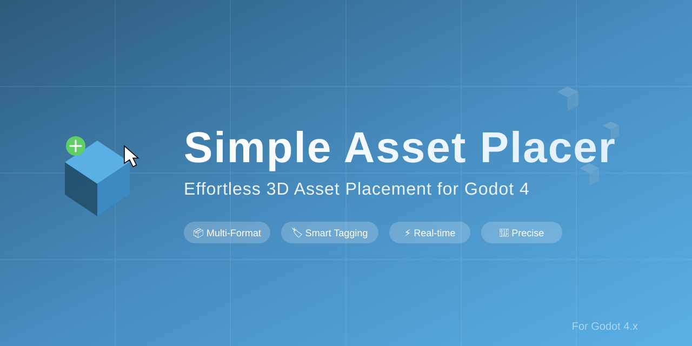
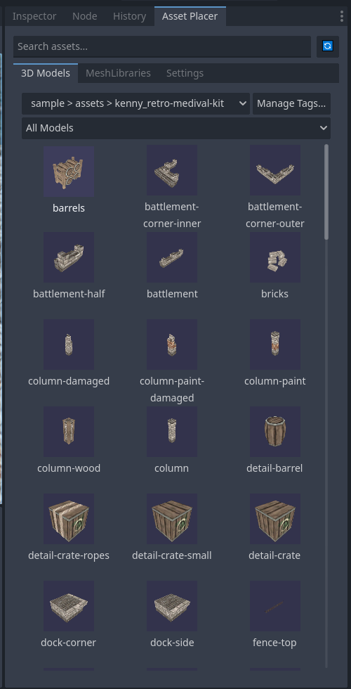
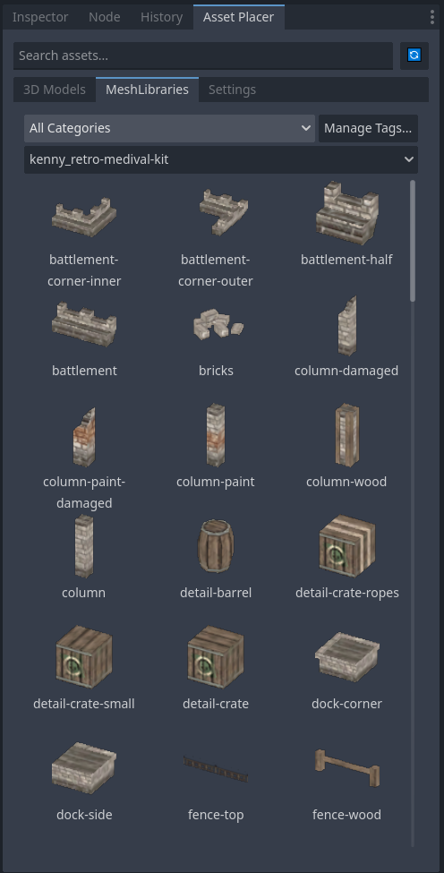
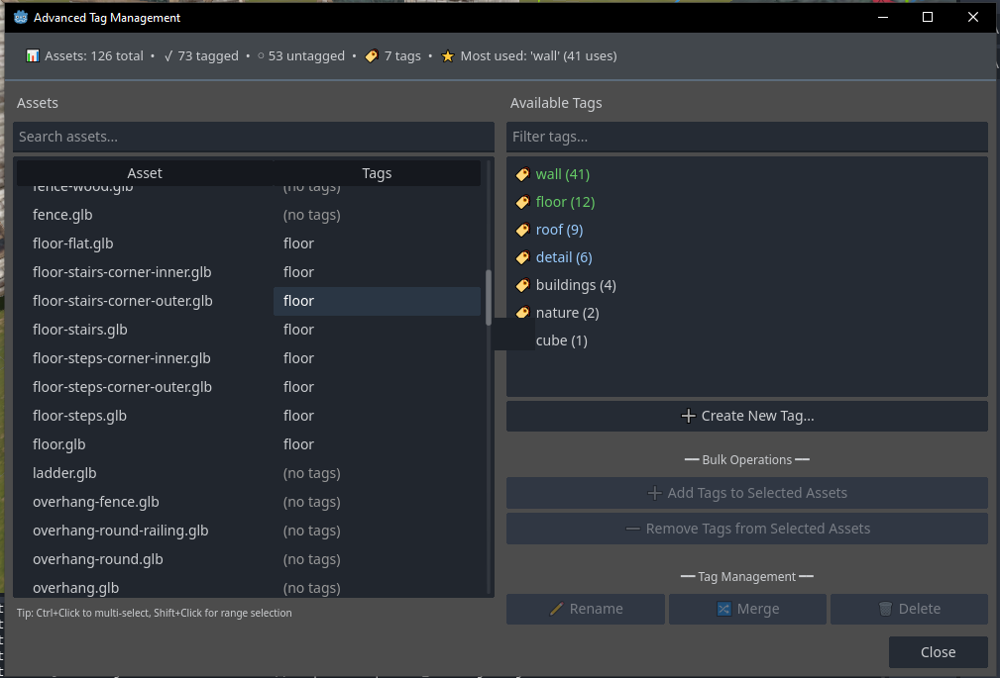

<div align="center">
  
</div>

---

# 🎯 Simple Asset Placer

**A powerful asset placement plugin for Godot 4.x designed to streamline level design workflows.**

Simple Asset Placer enhances your Godot Engine experience with professional asset placement capabilities. Place new assets with precision or transform existing objects in your scene—all through an intuitive dual-mode system.

> **Version 1.4.1** | All features documented below have been verified against the actual codebase. Source file references are provided throughout for transparency.

## ✨ Key Features

### 🎮 Dual Mode System
- **Placement Mode**: Intuitive asset placement with real-time preview and precise positioning
  - *Reference: `core/mode_state_machine.gd` - Mode.PLACEMENT*
- **Transform Mode**: Modify existing Node3D objects with the same familiar controls
  - *Reference: `core/mode_state_machine.gd` - Mode.TRANSFORM*
  - *Default hotkey: TAB (customizable)*

### 🔄 Asset Cycling
- Browse and switch between assets directly in the viewport using `[` and `]` keys
  - *Reference: `ui/modellib_browser.gd` - cycle_to_next_asset(), cycle_to_previous_asset()*
- Works with tap or hold for rapid browsing
- Respects current filters (categories, search, favorites)
- Auto-scrolls browser to show active asset

### 🏷️ Asset Organization
- **Automatic Folder Categories**: Extracts categories from your project structure
  - *Reference: `managers/category_manager.gd` - folder_categories*
- **Custom Tags**: Create and manage custom tags via `.assetcategories` JSON file
  - *Reference: `managers/category_manager.gd` - custom_tags*
- **Favorites**: Quick access to frequently used assets
  - *Reference: `managers/category_manager.gd` - EDITOR_SETTINGS_FAVORITES_KEY*
- **Recent Assets**: Automatic tracking of last 20 placed assets
  - *Reference: `managers/category_manager.gd` - MAX_RECENT_ASSETS = 20*

### ⌨️ Flexible Input System
- All hotkeys support modifier combinations (CTRL, ALT, SHIFT, META)
  - *Reference: `managers/input_handler.gd` - modifier key detection*
- Compatible with international keyboard layouts
- Full key binding customization via Settings tab
  - *Reference: `ui/placement_settings.gd` - key configuration*

### 🎯 Precision Placement
- **Grid Snapping**: Snap to customizable grid with offset support
  - *Reference: `utils/transform_math.gd` - snap functions, `managers/grid_manager.gd`*
- **Surface Alignment**: Automatically align rotation to surface normals
  - *Reference: `managers/rotation_manager.gd` - align_with_surface_normal()*
- **Collision-Based Placement**: Raycast positioning for natural object placement
  - *Reference: `placement/collision_placement_strategy.gd`*
- **Plane-Based Placement**: Place on virtual planes for architectural work
  - *Reference: `placement/plane_placement_strategy.gd`*

### 🎨 Visual Feedback
- Real-time preview mesh with position, rotation, and scale visualization
  - *Reference: `managers/preview_manager.gd`*
- Visual grid overlay during placement
  - *Reference: `managers/overlay_manager.gd` - show_grid_overlay()*
- Status information and transform values displayed in viewport
  - *Reference: `ui/status_overlay_control.gd`*

### ⚡ Performance & Quality
- Asynchronous asset scanning for non-blocking discovery
  - *Reference: `thumbnails/asset_scanner.gd`*
- Thumbnail caching system
  - *Reference: `thumbnails/thumbnail_generator.gd`, `thumbnails/thumbnail_queue_manager.gd`*
- Modular architecture with service-based dependency management
  - *Reference: `core/service_registry.gd`, `core/service_registry_builder.gd`*

## 🚀 Quick Start

### **Installation**
1. Download or clone this repository
2. Copy the `addons/simpleassetplacer/` folder to your project's `addons/` directory
3. Enable "SimpleAssetPlacer" in **Project → Project Settings → Plugins**
4. The "Asset Placer" dock appears automatically in the right panel of the editor

*Note: Make sure to copy the entire `addons/simpleassetplacer/` folder structure as shown in the Project Structure section below.*

### **Basic Usage - Placement Mode**
```
1. Open the Asset Placer dock (right panel).
2. Switch to the "3D Models" or "MeshLibraries" tab.
3. Click any asset thumbnail to start placement mode.
4. Move your mouse in the 3D viewport to position the preview.
5. Use Q/E keys (or mouse wheel) to rotate the object.
6. Use [ and ] keys to cycle through different assets without leaving the viewport.
7. Left-click to place the asset in your scene.
8. ESC to exit placement mode.
```

<div align="center">
  
  <p><i>Placement Mode in action - selecting, positioning, and placing assets</i></p>
</div>

### **Advanced Usage - Transform Mode**
```
1. Select any Node3D object(s) in the scene tree.
2. Press TAB (or your configured key) to enter Transform Mode.
3. Use mouse movement to reposition the object(s).
4. Use Q/E for rotation, W/A/S/D for precise positioning.
5. All placement controls work in Transform Mode.
6. Left-click to confirm changes, or ESC to cancel and restore original state.
```

<div align="center">
  
  <p><i>Transform Mode - modifying existing objects in the scene</i></p>
</div>

### **Asset Browser Interface**

<div align="center">
  
  <p><i>3D Models Browser - Browse, search, and organize your 3D assets</i></p>
</div>

<div align="center">
  
  <p><i>MeshLibrary Browser - Access GridMap mesh items</i></p>
</div>

### **Essential Controls**
- **Left-Click**: Place asset (Placement Mode) / Confirm changes (Transform Mode)
- **TAB**: Enter/exit Transform Mode (customizable)
- **[ / ]**: Cycle to previous/next asset during placement (customizable)
- **Mouse Movement**: Position object in 3D space via raycasting
- **Q / E**: Rotate around Y-axis
- **X / Y / Z**: Rotate around respective axes (customizable)
- **Mouse Wheel**: Fine rotation control
- **W/A/S/D**: Manual position adjustments (camera-relative)
- **Page Up/Down**: Scale up/down (customizable)
- **CTRL**: Fine adjustment mode (smaller increments)
- **ALT**: Large adjustment mode (bigger increments)
- **SHIFT**: Reverse direction for height adjustments
- **ESC**: Cancel and exit current mode

## 🔄 Asset Cycling - Stay in Your Flow

Browse and switch between assets without ever leaving the 3D viewport (introduced in v1.2.0).

### **How Asset Cycling Works**
While in Placement Mode with a preview visible:
- **Press `]`** to cycle to the next asset (*Reference: `ui/modellib_browser.gd` - cycle_to_next_asset()*)
- **Press `[`** to cycle to the previous asset (*Reference: `ui/modellib_browser.gd` - cycle_to_previous_asset()*)
- **Tap once** to switch to the next/previous asset
- **Hold the key** to rapidly browse through all assets
- Preview updates instantly - no interruption to your workflow!

### **Smart Context-Aware Cycling**
Cycling respects your current view and filters:
- ✅ **Filtered Categories**: Cycle only through assets in the selected category
- ✅ **Search Results**: Cycle through search matches
- ✅ **Favorites**: Cycle through favorited assets only
- ✅ **Custom Tags**: Cycle through tagged asset groups
- ✅ **Auto-scroll**: Browser automatically scrolls to show current asset
- ✅ **Wrap-around**: Last asset → first asset seamlessly

### **Works Everywhere**
- ✅ **3D Models Tab**: Cycle through .fbx, .obj, .gltf, etc.
- ✅ **MeshLibrary Tab**: Cycle through GridMap mesh items (*Reference: `ui/meshlib_browser.gd`*)
- ✅ **Both Tap and Hold**: Flexible input for your workflow

### **International Keyboard Support**
If your keyboard requires modifier keys for brackets:
1. Go to **Settings → Control Keys**
2. Click **"Cycle Next Asset"** button
3. Press your bracket combination (e.g., `CTRL+ALT+9`)
4. Click **"Cycle Previous Asset"** button  
5. Press your other bracket (e.g., `CTRL+ALT+8`)
6. Done! Cycling now works perfectly with your layout

## ⌨️ Controls & Key Bindings

### **Core Controls**
| Action               | Default Key      | Customizable | Description                                    |
|----------------------|------------------|--------------|------------------------------------------------|
| Transform Mode       | TAB              | ✅           | Enter/exit transform mode for selected objects |
| Place/Confirm        | Left-Click       | ❌           | Place asset or confirm transform changes       |
| Cancel               | ESC              | ✅           | Exit mode without placing/saving changes       |
| Cycle Next Asset     | ]                | ✅           | Switch to next asset in filtered view          |
| Cycle Previous Asset | [                | ✅           | Switch to previous asset in filtered view      |

### **Rotation Controls**
| Action               | Default Key      | Customizable | Description                                    |
|----------------------|------------------|--------------|------------------------------------------------|
| Rotate Y-Axis        | Q / E            | ✅           | Rotate around Y-axis (yaw)                     |
| Rotate X-Axis        | X                | ✅           | Rotate around X-axis (pitch)                   |
| Rotate Z-Axis        | Z                | ✅           | Rotate around Z-axis (roll)                    |
| Fine Rotation        | Mouse Wheel      | ❌           | Precise rotation control                       |
| Reset Rotation       | T                | ✅           | Reset all rotation offsets to zero             |

### **Position Controls**
| Action               | Default Key      | Customizable | Description                                    |
|----------------------|------------------|--------------|------------------------------------------------|
| Move Forward         | W                | ✅           | Move along camera forward axis                 |
| Move Backward        | S                | ✅           | Move along camera back axis                    |
| Move Left            | A                | ✅           | Move along camera left axis                    |
| Move Right           | D                | ✅           | Move along camera right axis                   |
| Height Up            | Q (when rotated) | ✅           | Increase height offset                         |
| Height Down          | E (when rotated) | ✅           | Decrease height offset                         |
| Reset Height         | R                | ✅           | Reset height offset to zero                    |
| Reset Position       | G                | ✅           | Reset position offsets to zero                 |

### **Scale Controls**
| Action               | Default Key      | Customizable | Description                                    |
|----------------------|------------------|--------------|------------------------------------------------|
| Scale Up             | Page Up          | ✅           | Increase scale multiplier                      |
| Scale Down           | Page Down        | ✅           | Decrease scale multiplier                      |
| Reset Scale          | Home             | ✅           | Reset scale multiplier to 1.0                  |

### **Modifier Keys**
| Modifier             | Effect                                                                                    |
|----------------------|-------------------------------------------------------------------------------------------|
| **CTRL**             | Fine adjustment mode (10% of base increment for rotation/scale/position)                  |
| **ALT**              | Large adjustment mode (10x base increment for rotation/scale/position)                    |
| **SHIFT**            | Reverse direction for height adjustments (Q/E become E/Q)                                 |

### **Controls in Action**

<div align="center">
  
  
  
  <p><i>Position, Rotation, and Scale controls demonstrated</i></p>
</div>

### **Advanced Key Binding Features**
- **Universal Modifier Support**: Use CTRL, ALT, SHIFT, META (Windows/Command key) alone or in combinations with ANY keybind.
- **International Keyboard Layouts**: Configure keys like `CTRL+ALT+8` for brackets on German keyboards, `ALT+5` on French keyboards, etc.
- **Conflict Prevention**: Plugin intercepts input at the highest priority to avoid conflicts with Godot's built-in shortcuts.
- **Per-Action Customization**: Every action can be remapped independently via the Settings tab.
- **Visual Feedback**: Settings panel shows current bindings and captures full key combinations including modifiers during key assignment.

## 🏷️ Category & Organization System

Simple Asset Placer includes a powerful category system that helps you organize and quickly find assets in large projects.

### **Automatic Folder-Based Categories**
The plugin automatically detects categories based on your folder structure:
```
res://assets/
├── props/          → "Props" category
│   ├── outdoor/    → "Props > Outdoor" 
│   └── indoor/     → "Props > Indoor"
├── vegetation/     → "Vegetation" category
└── buildings/      → "Buildings" category
```
**Features:**
- ✅ **Zero Configuration**: Works automatically with your existing folder structure
- ✅ **Hierarchical Display**: Shows nested folder relationships
- ✅ **Instant Filtering**: Select any folder category to see matching assets

### **Custom Tags System**
Add custom tags to assets for flexible organization:

**Creating Tags:**
1. Right-click any asset thumbnail
2. Select a recent tag or choose "+ New Tag..."
3. Tags are saved in `.assetcategories` file

**Tag File Format (`.assetcategories`):**
```json
{
  "tags": {
    "barrel_01": ["props", "outdoor", "medieval"],
    "tree_pine": ["vegetation", "forest", "nature"],
    "wall_stone": ["buildings", "medieval", "outdoor"]
  },
  "tag_usage": {
    "props": 3,
    "outdoor": 2,
    "medieval": 2
  },
  "recently_used": ["props", "outdoor"]
}
```

**Tag Features:**
- 🏷️ **Multiple Tags per Asset**: Assign unlimited tags to each asset
- 🔍 **Quick Access**: Recently used tags appear first in context menu
- 📊 **Usage Tracking**: Most-used tags prioritized automatically
- 💾 **Persistent Storage**: Tags saved in JSON format, easy to edit/version control

### **Favorites & Recent Assets**
**Favorites:**
- ⭐ Right-click any asset → "Add to Favorites"
- Quick access filter at top of category dropdown
- Persists across sessions in EditorSettings
- Perfect for frequently used assets

**Recent Assets:**
- 🕐 Automatically tracks last 20 used assets
- Shows in dedicated "Recent" filter
- Updates when you place assets
- Great for iterative level design

### **Visual Category Indicators**
Assets display color-coded badges on thumbnails:
- 🟡 **Gold Star**: Favorited asset
- 🟢 **Green Badge**: Custom tag
- 🔵 **Blue Badge**: Folder category

**Enhanced Tooltips:**
Hover over any asset to see:
- Asset name and path
- Favorite/Recent status
- All folder categories
- All custom tags

### **Category Filtering**
**Multi-Criteria Filtering:**
Combine filters for precise asset discovery:
1. **Text Search**: Filter by asset name
2. **Category**: Filter by folder or custom tag
3. **File Type**: Filter by format (FBX, OBJ, etc.)

**Filter Workflow:**
```
1. Select category from dropdown (e.g., "Props")
2. Narrow with file type filter (e.g., "FBX Files")
3. Use search box for specific names
→ Results show only matching assets
```

### **Context Menu Actions**
Right-click any asset for quick actions:
- 📁 **View Folder Categories**: See auto-detected categories
- 🕐 **Recent Tags**: Quick access to last 5 used tags
- 🏷️ **All Tags**: Browse all available tags
- ➕ **New Tag**: Create new custom tag
- ⭐ **Add to Favorites**: Mark as favorite

### **Advanced Tag Management Dialog**
Click the "Manage Tags..." button next to the category filter for powerful bulk operations:

<div align="center">
  
  <p><i>Advanced Tag Management Dialog - Bulk tag operations and organization</i></p>
</div>

**Features:**
- 📋 **Asset Table**: See all assets with their current tags
- 🔍 **Dual Search**: Filter assets and tags independently
- ✅ **Multi-Select**: Ctrl+Click or Shift+Click to select multiple assets
- ➕ **Bulk Add Tags**: Add selected tags to multiple assets at once
- ➖ **Bulk Remove Tags**: Remove tags from multiple assets
- 📊 **Live Statistics**: Real-time overview of tagged/untagged assets and tag usage
- ✏️ **Rename Tags**: Rename tags across all assets
- 🔀 **Merge Tags**: Combine multiple tags into one
- 🗑️ **Delete Tags**: Remove unused tags from the system

**Tag Management Workflow:**
```
1. Click "Manage Tags..." button
2. Select multiple assets (Ctrl+Click)
3. Select tag(s) from the right panel
4. Click "Add to Selected" or "Remove from Selected"
5. Use Rename/Merge/Delete for tag maintenance
→ Changes auto-save and refresh the asset grid
```

**Use Cases:**
- 🎯 **Batch Tagging**: Import 50 assets → Select all → Add "medieval" tag
- 🧹 **Tag Cleanup**: Merge "outdoor" and "exterior" into one tag
- 📊 **Audit Tags**: See which tags are most used, clean up duplicates
- 🔄 **Reorganize**: Rename tags to match new naming conventions

### **Best Practices**

**Folder Organization:**
```
✅ Good Structure:
res://assets/
├── environment/
│   ├── nature/
│   └── urban/
├── characters/
└── props/

❌ Avoid Flat Structure:
res://assets/
├── barrel1.fbx
├── tree1.fbx
└── (100+ files)
```

**Tag Naming Conventions:**
- Use lowercase for consistency
- Keep tags concise (1-2 words)
- Use descriptive names: "medieval", "outdoor", "destructible"
- Avoid overly specific tags

**Workflow Tips:**
- 🏷️ Tag assets as you import them
- ⭐ Favorite assets you use most often
- 🔍 Use text search + category filter together
- 📊 Review tag usage to identify common patterns

## ⚙️ Settings & Customization

Access all settings via the **Settings** tab in the Asset Placer dock.

### **Placement Settings**

#### **Snap & Alignment Options**
- **Snap to Ground**: Raycast-based surface snapping for natural object placement
- **Align with Surface Normal**: Automatically align object rotation to match surface angle
- **Grid Snap Enabled**: Snap positions to a customizable grid
- **Snap Step**: Grid size for X/Z axis snapping (default: 1.0)
- **Snap Y Enabled**: Enable height (Y-axis) snapping to a grid
- **Snap Y Step**: Grid size for Y-axis snapping (default: 1.0)
- **Snap Offset**: Global grid offset from world origin (Vector3)
- **Show Grid**: Display visual grid overlay during placement/transform
- **Grid Extent**: Size of grid visualization in world units (default: 20.0)

#### **Snap Center Options**
Control which part of the object is used for snapping:
- **Snap Center X**: Use object center for X-axis snapping
- **Snap Center Y**: Use object center for Y-axis snapping
- **Snap Center Z**: Use object center for Z-axis snapping

#### **Other Options**
- **Random Rotation**: Apply random Y-axis rotation on placement
- **Scale Multiplier**: Base scale applied to all placed objects
- **Add Collision**: Automatically add collision shapes (StaticBody3D) to placed objects
- **Group Instances**: Parent all placed instances under a common node

### **Reset Behavior**
Control what gets reset when exiting modes:
- **Reset Height on Exit**: Return height offset to zero
- **Reset Scale on Exit**: Return scale multiplier to 1.0
- **Reset Rotation on Exit**: Clear all rotation offsets
- **Reset Position on Exit**: Clear manual position offsets

### **Adjustment Increments**
Fine-tune the step sizes for all transformations:

**Rotation:**
- Base Increment: 15° (default)
- Fine Increment (CTRL): 5°
- Large Increment (ALT): 90°

**Scale:**
- Base Increment: 0.1
- Fine Increment (CTRL): 0.01
- Large Increment (ALT): 0.5

**Height:**
- Base Step: 0.1
- Fine Step (CTRL): 0.01
- Large Step (ALT): 1.0

**Position:**
- Base Step: 0.1
- Fine Step (CTRL): 0.01
- Large Step (ALT): 1.0

### **Key Binding Customization**
Every key can be remapped via the Settings tab:
1. Click the key button you want to change
2. Press the desired key combination (with or without modifiers)
3. Settings save automatically to EditorSettings

### **Cache Management**
- **Clear Thumbnail Cache**: Remove all cached thumbnails to free memory or regenerate corrupted previews

### **Persistence**
- Settings persist per-project in EditorSettings
- `.assetcategories` file stores custom tags (JSON format)
- Favorites and recent assets stored in EditorSettings for each project

## 🏗️ Architecture

Simple Asset Placer uses a modular, service-based architecture for maintainability and extensibility.

### **Core Systems**
- **ServiceRegistry** (*`core/service_registry.gd`*): Centralized dependency management and service lifecycle
- **ModeStateMachine** (*`core/mode_state_machine.gd`*): Mode state tracking (NONE, PLACEMENT, TRANSFORM)
- **PlacementModeController** (*`core/placement_mode_controller.gd`*): Coordinates placement mode operations
- **InputProcessor** (*`core/input_processor.gd`*): High-level input orchestration
- **KeyboardInputProcessor** (*`core/keyboard_input_processor.gd`*): Keyboard input processing

### **Manager Systems**
- **InputHandler** (*`managers/input_handler.gd`*): Low-level input detection with edge detection
- **PositionManager** (*`managers/position_manager.gd`*): 3D spatial calculations and raycasting
- **RotationManager** (*`managers/rotation_manager.gd`*): Rotation offsets and surface alignment
- **ScaleManager** (*`managers/scale_manager.gd`*): Scale multiplier calculations
- **PreviewManager** (*`managers/preview_manager.gd`*): Real-time preview mesh rendering
- **OverlayManager** (*`managers/overlay_manager.gd`*): Visual feedback and UI overlays
- **GridManager** (*`managers/grid_manager.gd`*): Grid snapping and visualization
- **CategoryManager** (*`managers/category_manager.gd`*): Asset organization and metadata

### **Placement Strategies**
- **PlacementStrategyService** (*`placement/placement_strategy_service.gd`*): Strategy coordinator
- **CollisionPlacementStrategy** (*`placement/collision_placement_strategy.gd`*): Raycast-based placement
- **PlanePlacementStrategy** (*`placement/plane_placement_strategy.gd`*): Virtual plane placement

### **UI Components**
- **AssetPlacerDock** (*`ui/asset_placer_dock.gd`*): Main dock interface
- **ModelLibraryBrowser** (*`ui/modellib_browser.gd`*): 3D model asset browser
- **MeshLibraryBrowser** (*`ui/meshlib_browser.gd`*): MeshLibrary resource browser
- **PlacementSettings** (*`ui/placement_settings.gd`*): Settings UI and configuration
- **TagManagementDialog** (*`ui/tag_management_dialog.gd`*): Bulk tag operations

### **Support Systems**
- **SettingsManager** (*`settings/settings_manager.gd`*): Configuration management
- **ThumbnailGenerator** (*`thumbnails/thumbnail_generator.gd`*): Asset preview generation
- **AssetScanner** (*`thumbnails/asset_scanner.gd`*): Asset discovery and validation
- **ErrorHandler** (*`utils/error_handler.gd`*): Error reporting
- **PluginLogger** (*`utils/plugin_logger.gd`*): Structured logging

## 📁 Project Structure

The plugin follows a modular architecture with clear separation of concerns:

```
addons/simpleassetplacer/
├── plugin.cfg                           # Plugin metadata (version 1.4.1)
├── simpleassetplacer.gd                 # Main plugin entry point
│
├── core/                                # Core systems
│   ├── service_registry.gd              # Dependency management
│   ├── service_registry_builder.gd      # Service initialization
│   ├── mode_state_machine.gd            # Mode state tracking
│   ├── placement_mode_controller.gd     # Placement coordination
│   ├── input_processor.gd               # High-level input
│   └── keyboard_input_processor.gd      # Keyboard handling
│
├── managers/                            # Manager systems
│   ├── input_handler.gd                 # Input detection
│   ├── position_manager.gd              # Position calculations
│   ├── rotation_manager.gd              # Rotation management
│   ├── scale_manager.gd                 # Scale management
│   ├── preview_manager.gd               # Preview rendering
│   ├── overlay_manager.gd               # Visual overlays
│   ├── grid_manager.gd                  # Grid snapping
│   ├── category_manager.gd              # Asset organization
│   └── utility_manager.gd               # Scene utilities
│
├── placement/                           # Placement strategies
│   ├── placement_strategy.gd            # Base strategy
│   ├── placement_strategy_service.gd    # Strategy service
│   ├── collision_placement_strategy.gd  # Raycast placement
│   └── plane_placement_strategy.gd      # Plane placement
│
├── ui/                                  # UI components
│   ├── asset_placer_dock.gd             # Main dock
│   ├── modellib_browser.gd              # 3D model browser
│   ├── meshlib_browser.gd               # MeshLibrary browser
│   ├── placement_settings.gd            # Settings UI
│   ├── tag_management_dialog.gd         # Tag management
│   └── status_overlay_control.gd        # Status display
│
├── settings/                            # Settings system
│   ├── settings_manager.gd              # Settings coordination
│   ├── settings_definition.gd           # Setting definitions
│   ├── settings_storage.gd              # Storage handling
│   └── settings_persistence.gd          # Persistence logic
│
├── thumbnails/                          # Asset scanning
│   ├── thumbnail_generator.gd           # Thumbnail rendering
│   ├── thumbnail_queue_manager.gd       # Generation queue
│   └── asset_scanner.gd                 # Asset discovery
│
└── utils/                               # Utility classes
    ├── plugin_logger.gd                 # Logging system
    ├── plugin_constants.gd              # Constants
    ├── error_handler.gd                 # Error reporting
    ├── transform_math.gd                # Math utilities
    └── ...                              # Additional helpers
```

**Optional Project Files:**
```
project_root/
└── .assetcategories                     # Custom tags (JSON)
```

*Note: For detailed version history and recent changes, see [CHANGELOG.md](CHANGELOG.md).*

## 🎮 Supported Asset Formats

*Reference: `utils/plugin_constants.gd` - SUPPORTED_*_EXTENSIONS constants*

### **3D Model Formats**
- **FBX** (.fbx): Autodesk Filmbox format
- **OBJ** (.obj): Wavefront object files
- **GLTF/GLB** (.gltf, .glb): Modern 3D transmission format with PBR support
- **DAE** (.dae): Collada interchange format
- **Blend** (.blend): Direct Blender file import (requires Blender)

### **Godot Native Formats**
- **TSCN** (.tscn): Godot text-based scene files
- **SCN** (.scn): Godot binary scene files
- **TRES** (.tres): Text-based resource files (validated for mesh content)
- **RES** (.res): Binary resource files (validated for mesh content)
- **MeshLibrary** (.meshlib): Optimized mesh collections for GridMap

### **Asset Detection**
- Plugin scans the `res://` directory recursively (*Reference: `thumbnails/asset_scanner.gd`*)
- Automatically skips `.godot` and hidden directories
- Ignores `res://addons` folder by default (*Reference: `managers/category_manager.gd` - EDITOR_SETTINGS_IGNORED_FOLDERS_KEY*)
- Only displays assets containing actual mesh data
- Ignored assets can be managed via context menu

## 💡 Tips & Workflow Optimization

### **Efficient Asset Organization**
- 📁 **Folder Structure**: Organize assets by category (buildings, props, nature) for automatic folder-based categorization
  ```
  res://assets/
  ├── environment/nature/     → Auto-detected as "environment > nature"
  ├── environment/urban/      → Auto-detected as "environment > urban"
  ├── characters/             → Auto-detected as "characters"
  └── props/                  → Auto-detected as "props"
  ```
- 🏷️ **Naming Convention**: Use descriptive names for easy identification in thumbnails
- 🏷️ **Tag Early**: Add custom tags via right-click context menu as you import assets
- ⭐ **Favorite Frequently Used**: Mark commonly used assets as favorites for instant filtering
- 📊 **Asset Sizes**: Keep reasonable polygon counts for smooth real-time placement
- 🔄 **Batch Operations**: Use Transform Mode to adjust multiple objects simultaneously

### **Placement Best Practices**
- 🎯 **Surface Alignment**: Enable "Snap to Ground" for natural object placement on terrain
- 🔄 **Surface Normal Alignment**: Enable "Align with Surface Normal" for objects that should match terrain slope
- 📏 **Grid Snapping**: Enable grid snap for architectural precision and consistent spacing
- 🌐 **Grid Visualization**: Enable "Show Grid" to see the snap grid during placement
- 🔍 **Camera Positioning**: Position your 3D viewport camera at optimal angles for placement
- 🛠️ **Terrain3D Collision**: When using Terrain3D plugin separately, enable its Collision option (set to "Dynamic / Editor") so raycasts detect the terrain surface
- ⌨️ **Hotkey Efficiency**: Customize keys in Settings tab for your most common operations
- 🔄 **Asset Cycling**: Use `[` and `]` keys to quickly browse asset variations without leaving the viewport

### **Transform Mode Workflow**
- 🎯 **Multi-Object Selection**: Select multiple Node3D objects to transform them as a group
- � **Group Center**: Objects rotate around their collective center while maintaining relative positions
- 🔄 **Non-Destructive**: Original transforms preserved - ESC to cancel and restore
- ✅ **Confirm Changes**: Left-click to apply transforms or ESC to cancel
- 🎮 **Same Controls**: All placement controls work identically in Transform Mode

### **Performance Optimization**
- 🖼️ **Thumbnail Cache**: Clear cache in Settings if thumbnails become corrupted or to free memory
- 🎨 **Thumbnail Size**: Plugin uses 64x64 thumbnails by default for fast rendering
- 💾 **Memory Usage**: Thumbnails cached in memory - clear cache for very large asset libraries
- 🔧 **Grid Extent**: Reduce grid extent value if grid overlay impacts performance
- 📦 **Asset Discovery**: Plugin scans on startup - large projects may take a moment

### **Collaborative Workflows**
- 📋 **Per-Project Settings**: Settings stored in EditorSettings, unique per project
- 🏷️ **Shared Tags**: Commit `.assetcategories` to version control for team tag sharing
- 🔑 **Key Standardization**: Document team key binding conventions in project wiki
- 📖 **Documentation**: Share folder organization structure with team members
- 🔄 **Version Control**: `.assetcategories` is a simple JSON file, merges cleanly in Git
- 🌍 **International Teams**: Universal keyboard support accommodates different layouts

## 🔧 Troubleshooting

### **Assets Not Appearing in the Dock**
- ✅ Ensure assets are located within your project's `res://` directory
- ✅ Verify file formats are supported (see "Supported Asset Formats" section)
- ✅ Check if assets contain actual mesh data (empty scenes won't appear)
- ✅ Click the **Refresh** button (🔄) in the dock header to rescan
- ✅ Check Godot's **Import** tab for asset import errors
- ✅ Ensure assets aren't in the "Ignored Assets" list (check EditorSettings)
- ✅ For MeshLibraries, make sure they're visible in the "MeshLibraries" tab, not "3D Models"

### **Thumbnails Not Generating or Appearing Blank**
- ✅ Clear thumbnail cache via **Settings → Clear Thumbnail Cache** button
- ✅ Check **Output** panel (bottom) for ThumbnailGenerator error messages
- ✅ Verify assets import correctly in Godot by opening them manually
- ✅ Ensure your GPU drivers are up-to-date (thumbnails use OpenGL rendering)
- ✅ Try restarting Godot if thumbnails appear corrupted
- ✅ For scenes (.tscn), ensure they contain visible MeshInstance3D nodes

### **Transform Mode Not Activating**
- ✅ Ensure you have at least one Node3D object selected in the Scene Tree
- ✅ Verify you're pressing the correct key (default: TAB, check Settings tab)
- ✅ Make sure you're in the 3D viewport (not Scene Tree or other panels)
- ✅ Plugin must be enabled in Project Settings → Plugins
- ✅ Check if TAB key is bound to another shortcut in Godot's Editor Settings

### **Placement Mode Issues**
- ✅ Verify you're working in a 3D scene with objects that have collision
- ✅ Ensure the 3D viewport camera is active and properly positioned
- ✅ Check that "Snap to Ground" is enabled if you want surface raycasting
- ✅ Try different camera angles if raycasting fails to hit surfaces
- ✅ Disable "Snap to Ground" for free-space placement
- ✅ For Terrain3D users: Enable Collision in Terrain3D settings

### **Object Not Appearing Where Expected**
- ✅ Check if grid snapping is enabled - disable to place freely
- ✅ Verify snap offset settings aren't moving objects unexpectedly
- ✅ Check height offset - press R to reset height to zero
- ✅ Press G to reset manual position offsets
- ✅ Disable "Align with Surface Normal" if objects are rotated oddly

### **Key Binding Problems**
- ✅ Open **Settings** tab to see current key assignments
- ✅ Verify keys aren't conflicting with Godot's built-in shortcuts
- ✅ Try reassigning problematic keys using modifier combinations (CTRL+ALT+key)
- ✅ For international keyboards: Use modifier combinations for special characters
- ✅ Remember: Plugin intercepts input ONLY during active Placement/Transform modes
- ✅ Press ESC to exit modes if keys seem unresponsive

### **Asset Cycling Not Working**
- ✅ Ensure you're in Placement Mode with a preview visible
- ✅ Check that `[` and `]` keys are properly configured in Settings
- ✅ For international keyboards, configure with modifiers (e.g., CTRL+ALT+8)
- ✅ Verify there are multiple assets visible in the current filtered view
- ✅ Try filtering by category to narrow down assets for cycling

### **Performance Issues**
- ✅ Clear thumbnail cache if using many large assets (Settings tab)
- ✅ Reduce grid extent value if grid overlay causes lag
- ✅ Check for asset import issues in Godot's import system
- ✅ Consider organizing assets into subdirectories for better management
- ✅ Monitor Godot's profiler if placement feels sluggish
- ✅ Disable grid overlay if not needed ("Show Grid" option)

### **Settings Not Persisting**
- ✅ Settings are stored in EditorSettings per-project automatically
- ✅ Custom tags stored in `.assetcategories` file at project root
- ✅ Ensure Godot has write permissions to your project directory
- ✅ Check if `.assetcategories` file exists for tag persistence
- ✅ Favorites/recent assets stored in EditorSettings, not in project files

### **Plugin Not Loading**
- ✅ Verify plugin is enabled: **Project → Project Settings → Plugins**
- ✅ Check for error messages in Godot's Output panel on startup
- ✅ Ensure all plugin files are present in `addons/simpleassetplacer/`
- ✅ Verify `plugin.cfg` file exists and is properly formatted
- ✅ Try disabling and re-enabling the plugin
- ✅ Restart Godot if the dock doesn't appear after enabling

## 🔬 Technical Implementation Notes

For developers interested in understanding or extending the plugin:

### **Mode System**
The plugin uses an enum-based mode system:
```gdscript
enum Mode {
    NONE,        # No active mode
    PLACEMENT,   # Placing new assets
    TRANSFORM    # Transforming selected objects
}
```
*Reference: `core/mode_state_machine.gd`*

### **Transform Calculations**
The plugin uses **additive offsets** rather than absolute transforms:

- **Rotation**: `final = original_rotation + surface_alignment + manual_offset`
  - *Reference: `managers/rotation_manager.gd`*
- **Scale**: `final = original_scale + scale_offset` (additive as of v1.4.1)
  - *Reference: `managers/scale_manager.gd`*
- **Position**: `final = raycast_position + height_offset + manual_position_offset`
  - *Reference: `managers/position_manager.gd`*

This preserves the original object state and allows non-destructive editing.

### **Grid Snapping**
Snapping uses a consistent formula:
```gdscript
snapped = floor((pos - offset) / step) * step + offset
```
- Per-axis control (X, Y, Z independently)
- Optional object center snapping
- *Reference: `utils/transform_math.gd` - snap functions*

### **Placement Strategies**
The plugin supports multiple placement strategies via the Strategy pattern:
- **CollisionPlacementStrategy**: Raycast-based placement with surface detection
- **PlanePlacementStrategy**: Virtual plane placement for architectural work
- Strategies are swappable at runtime via PlacementStrategyService
- *Reference: `placement/` directory*

### **Input Handling**
Input processing uses multiple layers:
1. **InputHandler**: Low-level input detection with edge detection (*`managers/input_handler.gd`*)
2. **KeyboardInputProcessor**: Keyboard-specific processing (*`core/keyboard_input_processor.gd`*)
3. **InputProcessor**: High-level input orchestration (*`core/input_processor.gd`*)
4. Plugin intercepts input via `_input()`, `_shortcut_input()`, and `_forward_3d_gui_input()`

### **Service Registry Pattern**
The plugin uses dependency injection via ServiceRegistry:
- Centralized service lifetime management
- Avoids circular dependencies
- Makes testing and extension easier
- *Reference: `core/service_registry.gd`, `core/service_registry_builder.gd`*

### **Asset Management**
- **AssetScanner**: Recursive directory scanning with format validation (*`thumbnails/asset_scanner.gd`*)
- **CategoryManager**: Metadata storage in `.assetcategories` JSON and EditorSettings (*`managers/category_manager.gd`*)
- **ThumbnailGenerator**: Isolated World3D rendering for clean thumbnail generation (*`thumbnails/thumbnail_generator.gd`*)

### **Settings Persistence**
Two storage mechanisms are used:
- **EditorSettings**: User preferences (key bindings, favorites) - stored per-project by Godot
- **Project File** (`.assetcategories`): Custom tags - version control friendly JSON
- *Reference: `settings/settings_manager.gd`, `settings/settings_persistence.gd`*

## 🤝 Contributing

Contributions are welcome! The plugin uses a clean, modular architecture with clear separation of concerns that makes adding features straightforward.

### **How to Contribute**
- 🐛 **Bug Reports**: Open GitHub issues with:
  - Godot version and OS
  - Detailed reproduction steps
  - Expected vs. actual behavior
  - Error messages from Output panel
  
- 💡 **Feature Requests**: Describe:
  - Use case and workflow context
  - Expected behavior
  - How it fits with existing features
  
- 🔧 **Code Contributions**: 
  - Follow the existing architectural patterns
  - Keep managers focused and single-purpose
  - Add logging via PluginLogger
  - Update CHANGELOG.md with your changes
  - Test thoroughly in Godot 4.x
  
- 📚 **Documentation**: 
  - Improve README clarity
  - Add code comments for complex logic
  - Create usage examples or tutorials

### **Development Guidelines**
- **Architecture**: Maintain separation between managers (no business logic in main plugin)
- **Input Handling**: All input detection goes through InputHandler
- **Settings**: Use SettingsManager for configuration
- **Logging**: Use PluginLogger with appropriate component tags
- **Error Handling**: Use ErrorHandler for user-facing errors

### **Development Setup**
1. Fork the repository on GitHub
2. Create a feature branch from `dev` (or `main` if no dev branch)
3. Make your changes following the guidelines above
4. Test thoroughly in Godot 4.x (ideally multiple versions)
5. Update CHANGELOG.md with your changes
6. Submit pull request with clear description

### **Code Style**
- Use GDScript type hints (`: Type`) for all parameters and variables
- Follow GDScript naming conventions (snake_case for functions/variables)
- Add docstrings for classes and complex functions
- Keep functions focused and under 50 lines when possible
- Use meaningful variable names

## 📄 License

This project is licensed under the MIT License - see the [LICENSE](LICENSE) file for details.

**TL;DR**: You can use, modify, and distribute this plugin freely, including in commercial projects. Attribution appreciated but not required.

## 🏆 Credits & Acknowledgments

**Author**: IIFabixn (aka LuckyTeapot)  
**Repository**: [github.com/IIFabixn/simple-asset-placer](https://github.com/IIFabixn/simple-asset-placer)  
**Version**: 1.4.1 (*Reference: `plugin.cfg`*)  
**Godot Version**: 4.x (tested on 4.3+)  
**License**: MIT

### **Feature Highlights**

This plugin implements the following verified capabilities:

- **Dual Mode System**: Placement and Transform modes (*`core/mode_state_machine.gd`*)
- **Asset Cycling**: Viewport-based asset browsing with `[` and `]` keys (*`ui/modellib_browser.gd`*)
- **Category System**: Automatic folder categories, custom tags, favorites, recent assets (*`managers/category_manager.gd`*)
- **Flexible Input**: Modifier key support (CTRL, ALT, SHIFT, META) for all hotkeys (*`managers/input_handler.gd`*)
- **Precision Placement**: Grid snapping, surface alignment, multiple placement strategies (*`managers/grid_manager.gd`, `managers/rotation_manager.gd`, `placement/` strategies*)
- **Visual Feedback**: Real-time preview and overlay system (*`managers/preview_manager.gd`, `managers/overlay_manager.gd`*)
- **Performance**: Asynchronous scanning, thumbnail caching (*`thumbnails/asset_scanner.gd`, `thumbnails/thumbnail_generator.gd`*)
- **Modular Architecture**: Service-based dependency management (*`core/service_registry.gd`*)

### **Acknowledgments**
- The **Godot Engine** team and community for creating an excellent open-source game engine
- Contributors and users who have provided feedback, bug reports, and feature suggestions
- The game development community for establishing best practices in level design workflows